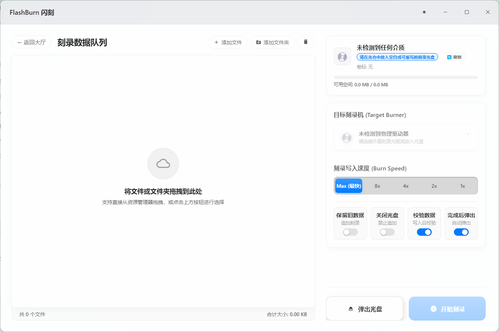

# ⚡ FlashBurn (闪刻) - 极简现代化物理光盘刻录与克隆桌面客户端

[](https://www.microsoft.com/windows)
[](https://www.electronjs.org/)
[](https://developer.mozilla.org/en-US/docs/Web/JavaScript)
[](LICENSE)

FlashBurn 是一款为 Windows 打造的轻量级 CD/DVD 刻录工具，采用 Windows 11 Fluent Design 视觉语言。100% 原生物理硬件支持，无需第三方驱动。

本项目坚持 **100% 物理硬件独占** 与 **极致静音设计**，去除了一切鸡肋的仿真逻辑，为您带来极佳的物理刻录质感。

---

## 📸 界面预览

### 主页面 (Home)


### 刻录界面 (Burn)


---

## ⚡ 架构设计与性能优化要点

1. **Vanilla Core（极速前端引擎）**：
   本系统前端采用 **100% 纯原生 HTML5 / ES6 JavaScript / Vanilla CSS** 开发，**完全没有引入 React、Vue、Tailwind、jQuery 等任何第三方沉重的前端框架与依赖**。这保证了渲染进程拥有最低的内存开销与绝对干净的 DOM 结构，启动毫秒级，执行速度极快。
2. **物理系统级集成 (Built-in Windows COM/IMAPI2)**：
   本程序**不打包任何庞大的第三方物理刻录 DLL，也无多余的驱动级底层安装包**。
   * 软件后台基于 Electron 主进程，通过 PowerShell 直接绑定 Windows 系统内核自带的 **MsftDiscFormat2Data (IMAPI2)** 物理烧录接口与 **WMI** 设备接口，调用系统底层自带资源完成扇区级的烧录与 ISO 对拷克隆。因此，软件的体积和稳定性得到了极佳的控制。

---

## 📂 项目结构说明

```
├── package.json        # 项目属性、 electron-builder 单免安装构建配置
├── main.js             # Electron 主进程 (生命周期、无边框窗体控制、PowerShell 底层总线调用)
├── preload.js          # 安全上下文桥接 (物理光驱底层 WMI/IMAPI2 接口映射)
├── index.html          # Windows 11 Fluent 页面骨架结构 (0框架 vanilla HTML5)
├── renderer.js         # 纯原生交互驱动 (硬件列表热重载、Quiet静音休眠、文件拖拽 API 解析)
├── styles.css          # Fluent 核心设计系统 (包含高度自适应、最大化60fps重画、HSL软投影)
├── detect_drives.ps1   # Native Windows COM 物理刻录总线交互脚本 (IMAPI2)
└── README.md           # 项目开源说明文档
```

---

## 🛠️ 本地运行与构建 (EXE 打包) 步骤

### 1. 克隆并安装依赖
在安装了 Node.js 的 Windows 电脑上，克隆项目后运行：
```bash
npm install
```

### 2. 开发调试运行
启动无边框的亚克力质感桌面客户端：
```bash
npm start
```

### 3. 构建 Portable 单文件独立版 `.exe`
运行以下命令：
```bash
npm run dist
```
构建引擎会自动执行并绕过 Windows 的软链接安全限制。打包完成后，会在根目录下的 `./dist` 文件夹中生成唯一的 **`FlashBurn 1.0.0.exe`** 独立免安装程序 (约 70MB)。
直接将其拷贝走分发至任何 Windows 电脑上，即可双击极速启动，享受物理刻录的极致快感！

---

## ⚖️ 开源协议

本项目采用 **MIT License** 许可协议开源
